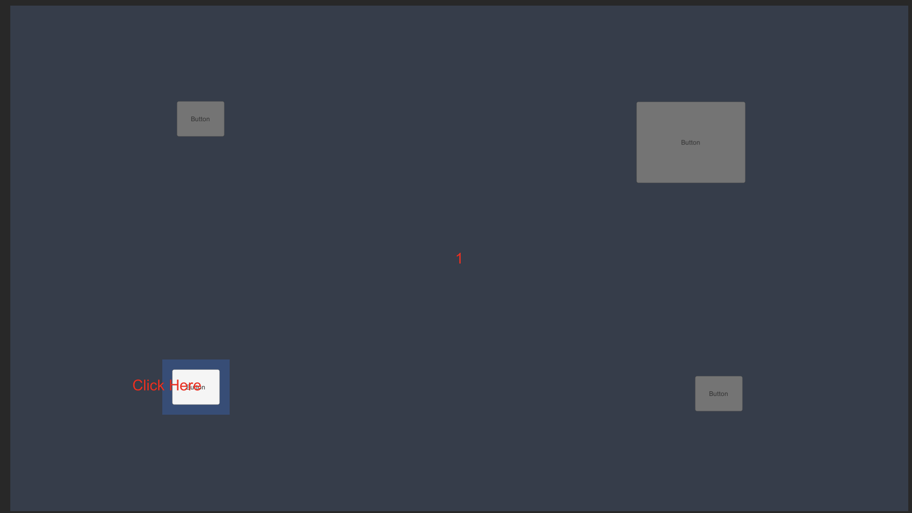
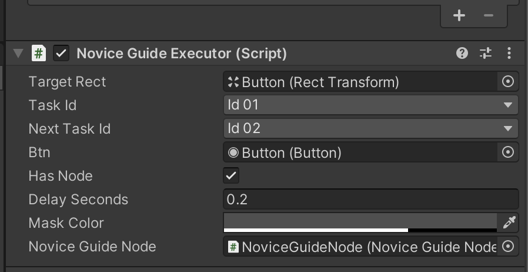
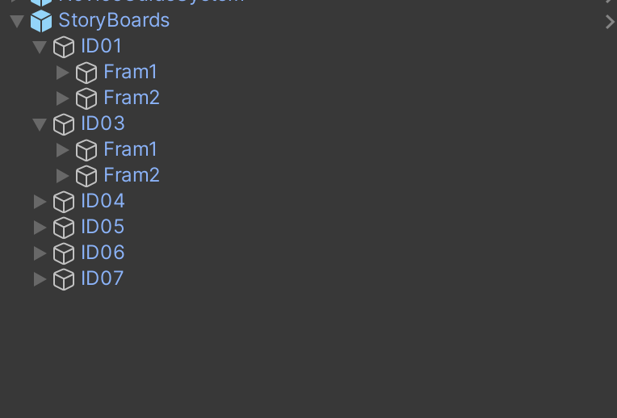

## NoviceGuide 

NoviceGuide 是一個強制新手教學流程的範例


## Features
依據場景上的互動元件來完成新手教學

## Version
Unity Version 2020.3.14f1

## Structure
- NoviceGuideSystem 新手強制導引主系統
- NoviceGuideNode 定義此節點互動相關說明訊息。例如:一段話、一張圖
- NoviceGuideExecutor 新手指引執行者，會依據自己的設置 taskId 循問 NoviceGuideTaskBucket 是否有符合當前任務編號
- NoviceStoryBoardPlayer 此層圖會置頂用來解決額外互動故事說明

## Description

### 互動元件資料結構
```angular2html
- TargetRect            可互動區(除了此區域可以交互外其餘地方無法交互)
- TaskId                當前的任務編號
- NextTaskId            執行節束後進入下一個任務編號
- Btn                   事件按鈕
- hasNode               是否有對話內容
- Delay Seconds         廷遲多少秒後進行動態演出
- Mask Color            不可交互區域的顏色
- NoviceGuideNode       顯示節點，可以用來描述一些說明
```
StoryBoardPlayer 資料結構


## How To Use
請參照 Example 內的範例 
